 

# bUecoding

 

 

---

 

<table width="100%">
<tr>
<td width="62%" valign="top">

</td>
<td width="48%" valign="top" align="center">

</td>
</tr>
</table>

 

---

 

I'm a developer focused on backend and full-stack development. I like building reliable systems and understanding how things work under the hood.

 

---

 

  

 

---

 

  

 

---

 

  

 

---

 

